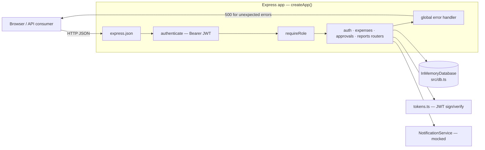
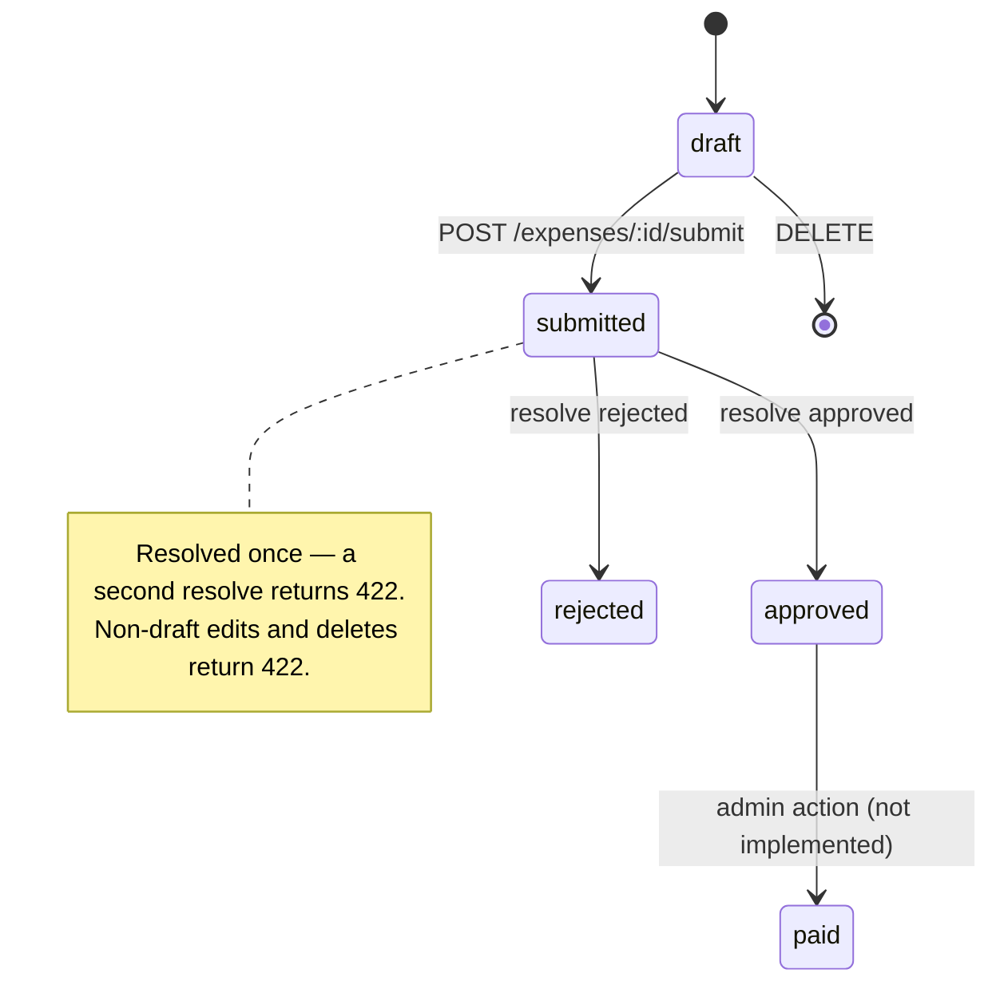
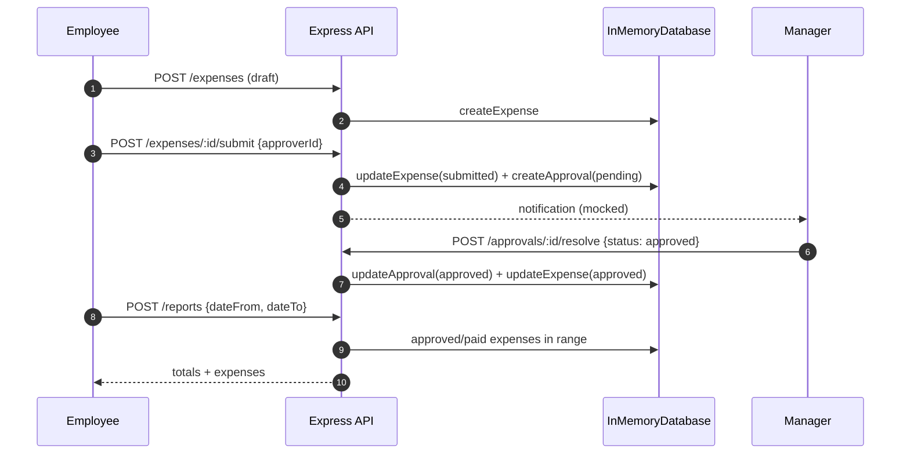

# ZeroCov — ExpenseFlow API

**IBM Bob 2.0 Hackathon submission** | Developer workflow: **testing**

ZeroCov is a structured IBM Bob 2.0 workflow that takes a production-shaped codebase
with thin test coverage and drives it to a high-coverage, spec-driven test suite in a
single session — running tests, reading failures, and fixing the source defects those
tests expose.

This repository contains the sample project (**ExpenseFlow API**) plus the Bob
configuration, session playbook, evidence, and a reproducible before/after baseline.

> **Read this first:** ExpenseFlow is a *synthetic fixture*. The two spec divergences
> described below were deliberately introduced so the workflow can be demonstrated
> end-to-end from a controlled baseline. The deliverable is the workflow — the defects
> exist to prove the workflow catches them.

**Live demo:** [zerocov.vercel.app](https://zerocov.vercel.app) — the deployed API with
an interactive console: run the full workflow against real routes, watch the
expired-token check return 401, and browse the rendered OpenAPI reference.

**Demo video:** [youtu.be/j0DtnV5fY9o](https://youtu.be/j0DtnV5fY9o) (2:53) — narrated
walkthrough with real terminal recordings of the baseline, red, and green states.

---

## Verified results

Measured with `pnpm test:coverage` on this repository:

| Metric | Before (baseline) | After (this session) | Delta |
|---|---|---|---|
| Statements | 22.77% | **89.46%** | +66.69 pp |
| Lines | 25.36% | **91.57%** | +66.21 pp |
| Branches | 5.00% | **77.31%** | +72.31 pp |
| Functions | 10.46% | **80.00%** | +69.54 pp |
| Test suites | 1 | **9** | +8 |
| Test cases | 14 | **145** | +131 |
| Session time | — | **~25 minutes** (Bob session) | — |

Per-module after: `auth/tokens` 100%, `reports` 100%, `utils` 100%, `approvals` 97.6%,
`auth/routes` 96.2%, `auth/middleware` 90.5%, `expenses` 87.8%, `db` 80%.

## What the spec-driven suites caught

The tests are written against `openapi.yaml` and `docs/` — not against current
behavior — so two divergences surfaced and were fixed:

1. **`auth/middleware.ts` — expired/invalid JWTs returned 500 instead of 401.**
   `docs/auth-security-requirements.md` requirement `EXP-TOKEN-401` and `openapi.yaml`
   both require 401 for any token verification failure. The middleware re-threw all
   JWT errors, which fell through to the global handler (500). Fixed; covered by
   `tests/unit/auth/middleware.test.ts`.
2. **`expenses/routes.ts` — amount validation bypassed the shared validator.**
   `POST` and `PATCH` used an inline `typeof amount !== 'number' || amount <= 0`
   check instead of `isValidAmount()`, so non-integer, non-finite (e.g. raw JSON
   `1e999` → `Infinity`) and above-cap amounts were accepted even though
   `openapi.yaml` declares `amount` as `type: integer, minimum: 1`. Fixed; the shared
   validator now enforces integer cents, finiteness, and the $10,000 cap.

Both fixes were driven by red tests: the test commits fail until the fix commits land
(see [REPRODUCING.md](REPRODUCING.md)).

## Architecture

ExpenseFlow is a small, production-shaped Express service: stateless JWT auth, role
guards, four resource routers over an in-memory repository, and a global error handler.
`openapi.yaml` and `docs/` are the source of truth for behavior.

### System overview



### Approval state machine



### Request lifecycle — submit and approve



### Auth model

- **Tokens** — HS256 JWTs. Access tokens (15m) and refresh tokens (7d) are signed from
  `JWT_SECRET` / `JWT_REFRESH_SECRET`; `POST /auth/refresh` issues a new access token.
- **Middleware** — every authenticated route runs `authenticate()`, which returns **401**
  for missing, malformed, invalid, or expired tokens (requirement `EXP-TOKEN-401`), then
  `requireRole()` returns **403** when the role is insufficient.
- **Roles** — `employee` (own expenses and reports), `manager` (assigned approvals, team
  expenses and reports), `admin` (all approvals and lists).

### Data model

| Entity | Key fields |
|---|---|
| `User` | id, email, passwordHash (bcrypt), name, role, createdAt |
| `Expense` | id, userId, amount (integer cents), category, description, status, createdAt, updatedAt |
| `ApprovalRequest` | id, expenseId, requesterId, approverId, status, comment?, createdAt, resolvedAt? |
| `Report` | id, userId, dateFrom, dateTo, categories?, generatedAt, format, expenses, totalAmount, expenseCount |

### API surface

All responses use the envelope `{ success, data?, error? }`.

| Method & path | Access | Success | Errors |
|---|---|---|---|
| `POST /auth/register` | public | 201 | 400 · 409 duplicate email |
| `POST /auth/login` | public | 200 | 400 · 401 (same response for unknown email and wrong password) |
| `POST /auth/refresh` | public | 200 | 400 · 401 |
| `POST /auth/logout` | bearer | 200 | 401 |
| `GET /auth/me` | bearer | 200 | 401 · 404 |
| `GET /expenses` | bearer | 200 | 401 |
| `POST /expenses` | bearer | 201 | 400 · 401 |
| `GET /expenses/:id` | bearer | 200 | 401 · 403 · 404 |
| `PATCH /expenses/:id` | bearer | 200 | 400 · 401 · 403 · 404 · 422 not draft |
| `DELETE /expenses/:id` | bearer | 200 | 401 · 403 · 404 · 422 not draft |
| `POST /expenses/:id/submit` | bearer | 201 | 400 · 401 · 403 · 404 · 422 |
| `GET /approvals` · `/approvals/pending` | manager/admin | 200 | 401 · 403 |
| `GET /approvals/:id` | bearer | 200 | 401 · 403 · 404 |
| `POST /approvals/:id/resolve` | manager/admin | 200 | 400 · 401 · 403 · 404 · 422 already resolved |
| `GET /reports` | bearer | 200 | 401 |
| `POST /reports` | bearer | 201 JSON / 200 CSV | 400 · 401 |
| `GET /reports/:id` | bearer | 200 | 401 · 403 · 404 |

### Running locally

```bash
pnpm install
pnpm dev              # ts-node src/index.ts — API on :3000
pnpm test:coverage    # 145 tests, 89.46% statements
```

### Deployment

[`server.ts`](server.ts) is the Vercel entrypoint (`framework: node`): it serves the
demo console at `/`, mounts the same Express app under `/api/*`, and adds
`/api/demo/flow` + `/api/demo/expired-token` for the interactive demo. Static assets
live in [`public/`](public/); the spec copy for the rendered API reference is produced
at build time from [`openapi.yaml`](openapi.yaml).

## The ZeroCov workflow

```
1. ASSESS      Bob reads openapi.yaml + docs/ + AGENTS.md, runs the coverage baseline
2. STRATEGIZE  Plan mode produces TEST-STRATEGY.md for human review and approval
3. EXECUTE     4 parallel subagents write tests for all layers simultaneously
               (auth, API handlers, integration flows, utilities)
4. VERIFY      Agent mode runs pnpm test:coverage, reads failures, fixes source defects
5. REPORT      COVERAGE-REPORT.md with the before/after delta and findings
6. READY       PR prepared for review
```

### IBM Bob 2.0 features used

| Feature | Where it is used |
|---|---|
| **Document understanding** | Bob reads `openapi.yaml`, `docs/auth-security-requirements.md`, `docs/approval-workflow.md` before writing a test, so assertions encode the contract, not the current behavior |
| **Plan mode** | Produces `TEST-STRATEGY.md`, reviewed and approved before any test is written |
| **Agent mode** | Writes test files, runs `pnpm test:coverage`, reads failures, fixes source defects, re-runs |
| **Parallel tasks / subagents** | Four focused subagents (`auth-tests`, `api-tests`, `integration-tests`, `utils-tests`) run simultaneously, each with an isolated context |
| **Rules / SKILL.md / AGENTS.md** | `.bob/rules/testing-standards.md`, `.bob/skills/test-strategist/SKILL.md`, `AGENTS.md` keep every subagent spec-driven and consistent |
| **PR workflow** | Session output is prepared as a reviewable pull request |

## Reproducing the before/after

```bash
pnpm install

# Before — pre-session baseline: 22.77% statements, 1 suite, 14 tests
git checkout zerocov-baseline
pnpm test:coverage

# After — post-session: 89.46% statements, 9 suites, 145 tests
git checkout main
pnpm test:coverage
```

For the red → green sequence (tests fail before the source fixes land), see
[REPRODUCING.md](REPRODUCING.md).

To re-run the workflow itself with IBM Bob 2.0, follow
[BOB-SESSION-PLAYBOOK.md](BOB-SESSION-PLAYBOOK.md).

## Bob session evidence

Bob task session summary screenshots required by the hackathon live in
[`bob_sessions/`](bob_sessions/). See that folder's README for naming conventions and
what each screenshot shows.

The full session diff — 131 new tests, the two source fixes, and the reports — is
[PR #1](https://github.com/PhiBao/zerocov/pull/1) (merged into `main`).

## Project structure

```
src/
  auth/          JWT tokens, authenticate/requireRole middleware, auth routes
  expenses/      Expense CRUD + submit
  approvals/     Multi-step approval resolution
  reports/       Date-range report generation (JSON + CSV)
  notifications/ Mocked notification service
  utils/         Shared helpers, validation, error classes
  db.ts          In-memory database with reset()
  app.ts         Express app factory
server.ts        Vercel entrypoint: demo console + /api mount + demo endpoints
public/          Static demo console (index.html + openapi.yaml copy)
vercel.json      Deployment config (framework: node)
tests/
  unit/          auth/, expenses/, approvals/, reports/, utils/
  integration/   End-to-end approval workflow
docs/
  approval-workflow.md            Approval state machine (source of truth)
  auth-security-requirements.md   Required auth status codes (source of truth)
openapi.yaml                      Full API contract (source of truth)
.bob/                             Bob rules, skills, and subagent prompts
AGENTS.md                         Persistent project context for Bob
BOB-SESSION-PLAYBOOK.md           Exact session prompts
COVERAGE-REPORT.md                Measured before/after coverage + findings
REPRODUCING.md                    Baseline and red → green reproduction steps
bob_sessions/                     Bob task session summary evidence
```

## Stack

Node.js 22 · TypeScript 5 · Express 4 · Jest 29 + ts-jest + Supertest · JWT · bcryptjs · pnpm

## License

MIT — see [LICENSE](LICENSE).
